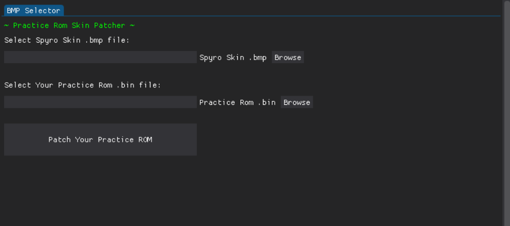

# Spyro 1 Practice Rom Skin Patcher & Tester

## Patcher

This tool allows you to patch your own custom spyro skin into the [Spyro 1 Practice Rom](https://github.com/C0mposer/Spyro-1-Practice-Codes)

Simply choose the the .bmp of your custom spyro skin, and your practice rom .bin file.  

Once you have patched the rom, you can select your skin in the game by choosing the **SPYRO SKIN CUSTOM** option.

## Tester
This tool allows you to quickly inject Spyro, Flame, and Sparx skins into supported emulators for quick testing.  

There are also color wheels to test different flame tip colors, and sparx glow colors.

*(note the tester is still in development, and mainly used for rapid prototyping for the practice rom)*

### Supported Tester Emulators
- [Duckstation 0.1 5936](https://github.com/stenzek/duckstation/releases/tag/latest)  

 - [Bizhawk 2.6.1](https://tasvideos.org/BizHawk/ReleaseHistory#Bizhawk261)   